# 🚗 Projeto Multi-Agente com MCP – Zouza Motors

## Introdução do Problema  
O desafio  foi criar um sistema de atendimento inteligente para uma concessionária fictícia, a **Zouza Motors**, que pudesse automatizar interações típicas de clientes em três áreas fundamentais:  
1. **Recepção** – o primeiro contato, apresentando a empresa e direcionando o atendimento.  
2. **Vendas** – suporte ao processo de compra de veículos e agendamento de visitas/test drives.  
3. **Manutenção** – agendamento de revisões e suporte pós-venda.  

A ideia central foi mostrar como **IA Generativa + MCP (Model Context Protocol)** podem ser usados em conjunto para orquestrar diferentes agentes especializados, cada um responsável por uma parte da jornada do cliente.

---

## Solução: Arquitetura Multi-Agente  
O projeto utilizou **três agentes que trabalham em parceria**:  

- **Agente de Recepção**  
  - Responsável por dar boas-vindas, apresentar a empresa e encaminhar o cliente.  
  - Pode transferir o atendimento para o agente de vendas ou de manutenção.  

- **Agente de Vendas**  
  - Consulta os veículos disponíveis (`get_veiculos_disponiveis`).  
  - Ajuda a entender as preferências do cliente.  
  - Consulta concessionárias (`get_concessionarias`) e vendedores (`get_vendedores_por_concessionaria`).  
  - Agenda visitas para compra com a ferramenta `agenda_visita_para_compra`.  

- **Agente de Manutenção**  
  - Identifica o cliente e seus veículos (`get_info_cliente`).  
  - Coleta informações sobre a necessidade de revisão/manutenção.  
  - Agenda o serviço na concessionária onde o cliente comprou o carro (`agenda_visita_para_assistencia`).  

Esses agentes foram implementados em **Python**, utilizando:  
- `FastMCP` para disponibilizar ferramentas conectadas ao banco de dados.  
- `Streamlit` para interface de chat, simulando um atendimento em tempo real.  
- **Orquestração multi-agente** com handoffs, onde um agente pode repassar a conversa a outro.  
- Conexão com **PostgreSQL online**, permitindo acesso em **tempo real** às informações de veículos, concessionárias, vendedores e clientes.  

---

## Passo a Passo da Implementação  

### 1. Criação das ferramentas (MCP Server)  
As ferramentas foram expostas através do **FastMCP**, permitindo consultas em tempo real ao banco PostgreSQL:

Conectando ao Banco de dados:
```python
# ===============================================================
# Configuração do Servidor MCP e Conexão com PostgreSQL
# ===============================================================
#
# Este trecho inicializa um servidor MCP (Model Context Protocol) chamado "FerramentasAssistenteNovaDriveMotors", que expõe as
# ferramentas (tools) que os agentes vão utilizar durante o atendimento. O MCP permite que os agentes chamem funções Python
# como se fossem "APIs internas".
#
# A conexão é feita com um banco de dados PostgreSQL online, onde ficam armazenadas as informações sobre veículos, clientes,
# concessionárias e vendedores. Os dados em tempo real consultados por esse banco permitem que os agentes forneçam respostas atualizadas
# e coerentes durante a conversa.
#
# A string de conexão (CONN_STR) é parametrizada com host, porta, nome do banco, usuário e senha. A função get_connection() encapsula
# a criação da conexão, garantindo que as ferramentas MCP que precisam acessar o banco reutilizem sempre a mesma lógica.
#
# Dependência: psycopg2 (driver Python para PostgreSQL).
# ===============================================================

from mcp.server.fastmcp import FastMCP
import psycopg2, json

mcp = FastMCP("FerramentasAssistenteNovaDriveMotors", dependencies=["psycopg2"])

SERVER = "255.255.255.255"
PORT = "5432"
DATABASE = "zouzamotors"
USERNAME = "zouza"
PASSWORD = "9i2Gh8#blsz9yds@-=@"

CONN_STR = {
    "host": SERVER,
    "port": PORT,
    "dbname": DATABASE,
    "user": USERNAME,
    "password": PASSWORD,
}

def get_connection():
    return psycopg2.connect(**CONN_STR)
```

As ferramentas (tools) implementadas neste projeto conectam os agentes a um banco PostgreSQL online em tempo real, permitindo que cada etapa do atendimento seja suportada por dados atualizados da concessionária.

```python
# A função `get_veiculos_disponiveis` retorna a lista de veículos disponíveis para venda, trazendo nome, tipo e valor, sendo utilizada pelo agente de vendas para apresentar opções ao cliente.

@mcp.tool()
def get_veiculos_disponiveis():
    """Retorna os veículos/carros disponíveis para a compra"""
    try:
        conn = get_connection()
        cursor = conn.cursor()
        cursor.execute("SELECT nome, tipo, valor FROM veiculos v;")
        rows = cursor.fetchall()
        result = [dict(zip([desc[0] for desc in cursor.description], row)) for row in rows]
        cursor.close()
        conn.close()
        return json.dumps(result, indent=4, sort_keys=True, default=str)
    except Exception as e:
        return {"error": str(e)}

# A função `get_concessionarias` fornece informações sobre as concessionárias, incluindo cidade e estado.
@mcp.tool()
def get_concessionarias():
    """Retorna as concessionárias e suas informações de localização"""
    try:
        conn = get_connection()
        cursor = conn.cursor()
        
        cursor.execute("""
            SELECT c.id_concessionarias, c.concessionaria, c2.cidade, e.estado, e.sigla 
            FROM concessionarias c
            JOIN cidades c2 ON c2.id_cidades = c.id_cidades
            JOIN estados e  ON c2.id_estados = e.id_estados;
        """)
        
        rows = cursor.fetchall()
        result = [dict(zip([desc[0] for desc in cursor.description], row)) for row in rows]
        cursor.close()
        conn.close()
        return json.dumps(result, indent=4, sort_keys=True, default=str)
    except Exception as e:
        return {"error": str(e)}

# `get_vendedores_por_concessionaria` recebe como parâmetro o id da concessionária e retorna os vendedores associados, permitindo que o agente de vendas direcione o atendimento e agende uma visita.
@mcp.tool()
def get_vendedores_por_concessionaria(id_concessionarias: int):
    """Retorna os vendedores por id de concessionária"""
    try:
        with get_connection() as conn:
            with conn.cursor() as cursor:
                cursor.execute("""
                    SELECT v.id_vendedores, v.nome 
                    FROM vendedores v 
                    WHERE v.id_concessionarias = %s;
                """, (id_concessionarias,))
                
                rows = cursor.fetchall()
                result = [dict(zip([desc[0] for desc in cursor.description], row)) for row in rows]
        return json.dumps(result, indent=4, sort_keys=True, default=str)
    except Exception as e:
        return {"error": str(e)}

# A função `get_info_cliente` consulta os dados de um cliente pelo nome, trazendo também informações sobre o veículo adquirido, concessionária, data de venda e valor pago. Essa ferramenta é utilizada pelo agente de manutenção antes de agendar revisões ou assistências, garantindo que apenas clientes existentes possam prosseguir com esse tipo de atendimento.
@mcp.tool()
def get_info_cliente(nome: str):
    """Retorna as informações do cliente pelo nome. Retorna junto com carros/veículos que foram comprados e onde."""
    try:
        with get_connection() as conn:
            with conn.cursor() as cursor:
                cursor.execute("""
                    SELECT c.id_clientes, 
                           c.cliente, 
                           c2.concessionaria, 
                           c3.cidade, 
                           e.estado, 
                           v.data_venda, 
                           v.valor_pago, 
                           v2.nome as carro 
                    FROM clientes c
                    JOIN concessionarias c2 on c.id_concessionarias = c2.id_concessionarias
                    JOIN cidades  c3 ON c3.id_cidades = c2.id_cidades
                    JOIN estados   e ON e.id_estados  = c3.id_estados
                    JOIN vendas    v ON v.id_clientes = c.id_clientes
                    JOIN veiculos v2 ON v.id_veiculos = v2.id_veiculos
                    WHERE c.cliente  = %s;
                """, (nome,))
                
                rows = cursor.fetchall()
                result = [dict(zip([desc[0] for desc in cursor.description], row)) for row in rows]
        return json.dumps(result, indent=4, sort_keys=True, default=str)
    except Exception as e:
        return {"error": str(e)}

# Não implementado por completo
@mcp.tool()
def agenda_visita_para_compra(id_concessionaria: int, id_vendedor: int, data_hora: str):
    """Agenda uma visita na concessionária e vendedor no horário estipulado"""
    try:
        # TODO: fazemos de conta
        return {"message": "Visita agendada com sucesso!"}
    except Exception as e:
        return {"error": str(e)}

# Não implementado por completo
@mcp.tool()
def agenda_visita_para_assistencia(id_cliente: int, id_concessionaria: int, nome_carro: str, detalhes: str, data_hora: str):
    """Agenda uma visita na concessionária para manutenções ou revisões, apenas para clientes que já possuem carro/veículo"""
    try:
        # TODO: fazemos de conta
        return {"message": "Visita de manutenção/revisão agendada com sucesso!"}
    except Exception as e:
        return {"error": str(e)}
    
# Já as funções `agenda_visita_para_compra` e `agenda_visita_para_assistencia` simulam o agendamento de visitas, seja para a compra/test drive de um veículo, seja para manutenção ou revisão. No futuro, essas funções podem ser integradas com APIs reais de CRM ou de agendamento da concessionária.

# Com essa arquitetura, cada agente utiliza apenas as ferramentas pertinentes ao seu papel, criando uma experiência integrada, escalável e orientada a dados em tempo real.

```

### 2. Definição dos Agentes  
Cada agente recebeu instruções específicas e permissões de uso das ferramentas. Exemplo:

```python
# Agente especializado em manutenção/revisão.
# Atua apenas para clientes já existentes, usando get_info_cliente para confirmar dados
# e agenda_visita_para_assistencia para marcar serviços pós-venda.
agenteManutencao = Agent( 
    name="ManutencaoAssistente", 
    model="gpt-4o",
    handoff_description="Assistente de manutenção/revisão para clientes que já possuem veículo/carro.",
    instructions="Você é um assistente da Zouza Motors que deve ajudar o cliente a agendar uma visita para manutenção ou revisão." \
        "Pergunte o nome completo para identificar o cliente e então use as ferramentas para descobrir os veículos/carros que tem (get_info_cliente). " \
        "Com base nisso colete as informações do que ele precisa, agende um horário na concessionária onde comprou o veículo (com agenda_visita_para_assistencia)." \
        "Não é necessario escolher um vendedor, apenas agendar a visita na concessionária onde comprou o veículo/carro. ",
    model_settings=ModelSettings(tool_choice="auto", temperature=0, parallel_tool_calls=False), 
)

# Agente responsável por vendas e prospecção.
# Consulta veículos disponíveis, apresenta opções, identifica preferências do cliente
# e finaliza com agendamento de visita usando agenda_visita_para_compra.
agentVendas = Agent(  
    name="VendasAssistente", 
    model="gpt-4o",
    handoff_description="Assistente para trativa de vendas, informações sobre veículos e agendamento de visitas/test drive.",
    instructions="Você é um assistente da Zouza Motors que deve ajudar e convencer o cliente a comprar um carro/veículo." \
        "Antes de tudo use a ferramenta get_veiculos_disponiveis para conhecer as opções disponíveis e apresentar a ele. " \
        "Você pode fazer perguntas para entender o que o cliente precisa e oferecer as melhores opções de veículos/carros baseado na ferramenta que você chamou. " \
        "Quando o cliente decidir, agende uma visita na concessionária mais próxima do cliente, para descobrir as concessionárias use get_concessionarias " \
        "e para descobrir os vendedores dessa concessionária use get_vendedores_por_concessionaria." \
        "Então, agende a visita com a ferramenta agenda_visita_para_compra, onde você vai escolher o vendedor e a concessionária mais próxima do cliente.",
    model_settings=ModelSettings(tool_choice="auto", temperature=0, parallel_tool_calls=False), 
)

# Agente que inicia o atendimento (recepção).
# Responsável por dar boas-vindas, apresentar a empresa, mostrar o site oficial
# e encaminhar o cliente para vendas ou manutenção via handoff.
agentRecepcao = Agent( 
    name="RecepcaoAssistente", 
    model="gpt-4o",
    handoffs=[agentVendas, agenteManutencao], # quais ele pode chamar (handoff)
    instructions="Você é um assistente de recepção da Zouza Motors, uma empresa nacional de veículos/carros do Brasil." \
        "Você é responsável pela recepção e deve apenas apresentar a empresa e oferecer as opções disponíveis. " \
        "Apresente a Zouza Motors como empresa de veículos/carros e orgulhosamente brasileira." \
        "Mostre o site https://www.zouzamotors.com.br/ para conhecer mais sobre a empresa." \
        "Ofereça para conhecer os carros e agendar uma visita com vendedor com possibilidade de test drive." \
        "Ou então no caso de querer manutenção ou revisão pode agendar uma visita a concessionária.",
    model_settings=ModelSettings(tool_choice="auto", temperature=0, parallel_tool_calls=False), 
)
```

### 3. Interface de Usuário (Chat com Streamlit)  
A interação foi construída com **Streamlit**, permitindo simulação de chat em tempo real:

```python
# Exibe o título centralizado na interface web (Streamlit).
st.markdown("<h1 style='text-align: center;'>Zouza Motors</h1>", unsafe_allow_html=True)

# Campo de entrada no estilo chat, onde o usuário digita sua pergunta.
prompt = st.chat_input("Digite sua pergunta:")

# Se o usuário enviou uma mensagem, adiciona no histórico da sessão.
if prompt:
    st.session_state.history.append({"role": "user", "content": prompt})

    # Exibe a mensagem do usuário no chat da interface.
    with st.chat_message("user"):
        st.markdown(prompt)

    # Enquanto o modelo responde, mostra um spinner "Pensando..."
    with st.spinner("Pensando..."):
        asyncio.run(resolve_chat())  # Chama a função que orquestra os agentes e resolve o chat.
        st.rerun()  # Recarrega a página para atualizar a interface com a nova resposta.

```

### 4. Orquestração com MCP  
O **Runner** inicia os agentes e mantém o fluxo da conversa:

```python
# Função assíncrona responsável por orquestrar a execução do chat multi-agente.
# 1. Inicia um servidor MCP (servidor de ferramentas externas) a partir do script server_agente_atendente.py.
# 2. Associa esse servidor tanto ao agente de vendas quanto ao de manutenção,
#    garantindo que eles tenham acesso às mesmas ferramentas (consultas em tempo real ao Postgres).
# 3. Usa o Runner.run para processar a interação:
#    - starting_agent: agente que inicia a rodada da conversa.
#    - input: histórico completo de mensagens até o momento.
#    - context: contexto da sessão (usado para manter coerência).
# 4. Atualiza o agente corrente (quem respondeu por último) e também o histórico
#    de mensagens no estado da sessão do Streamlit.
async def resolve_chat(): 
    async with MCPServerStdio(params={"command": "mcp", "args": ["run", "servers/server_agente_atendente.py"]}) as server:
        st.session_state.agentVendas.mcp_servers = [server] 
        st.session_state.agenteManutencao.mcp_servers = [server] 

        result = await Runner.run(
            starting_agent=st.session_state.current_agent, 
            input=st.session_state.history, 
            context=st.session_state.history
        )
        st.session_state.current_agent = result.last_agent
        st.session_state.history = result.to_input_list()

```

---

## Passo a Passo do uso (em imagens)

> **Fluxo de Vendas**
1. Abertura do app e mensagem de boas‑vindas.  
   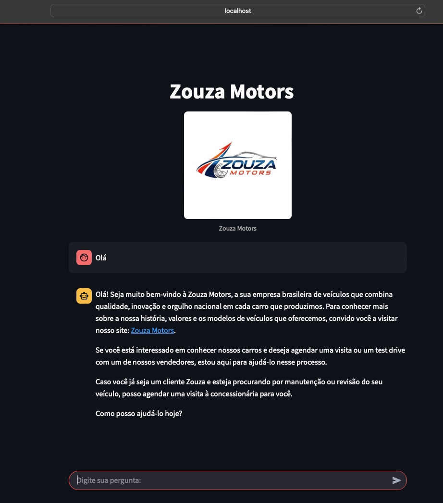

2. Consulta ao catálogo (ex.: “Superesportivo”).  
   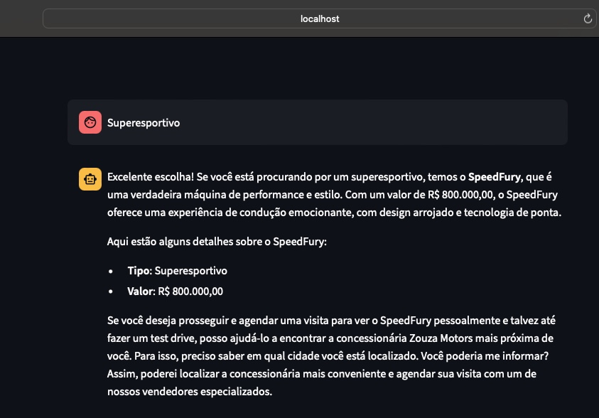

3. Busca de concessionárias via tool `get_concessionarias`.  
   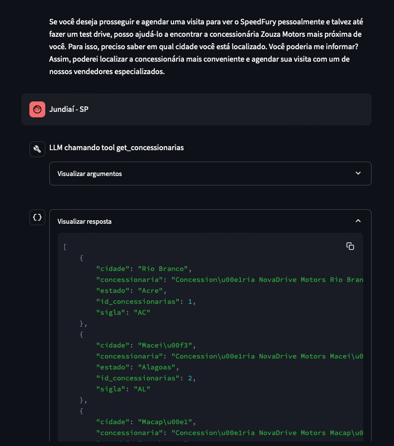

4. Busca de vendedores via tool `get_vendedores_por_concessionaria`.  
   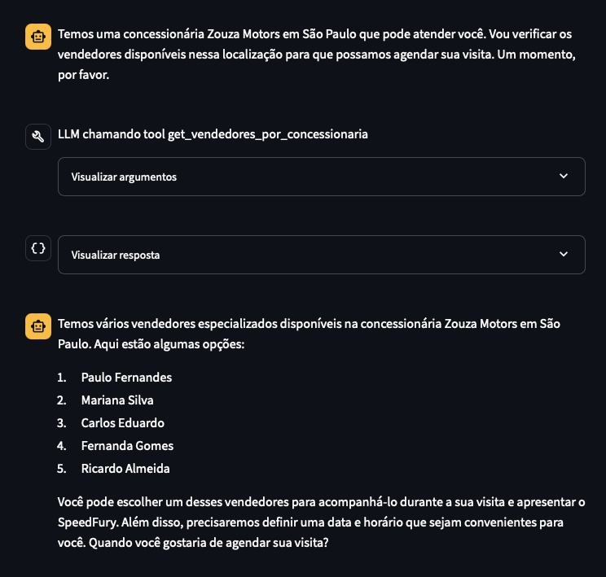

5. Validação de data/horário informados pelo usuário.  
   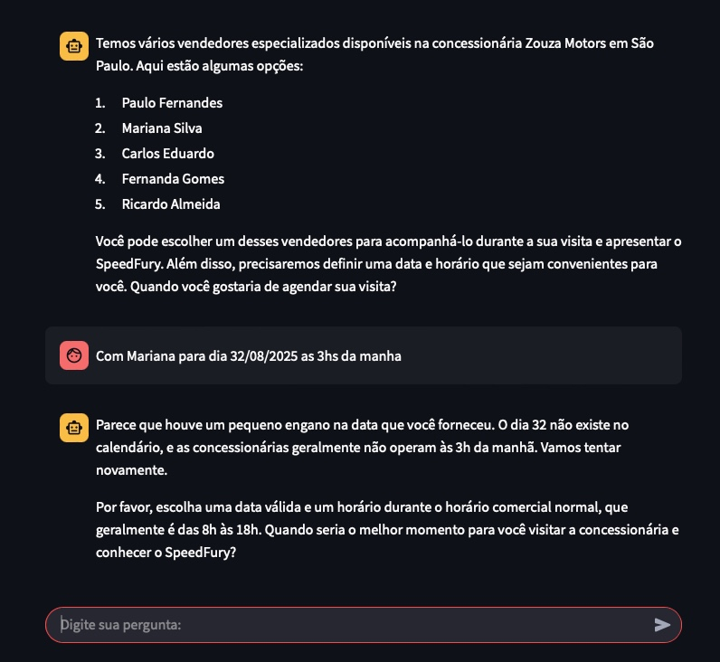

6. Agendamento de visita para compra via tool `agenda_visita_para_compra`.  
   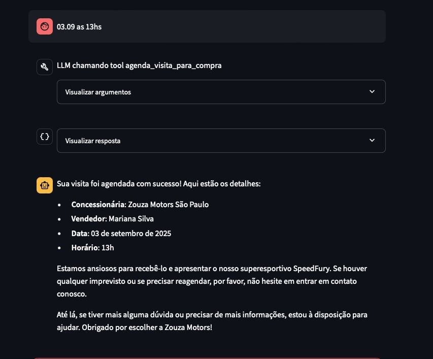

> **Fluxo de Manutenção**
7. Solicitação de revisão para outro veículo.  
   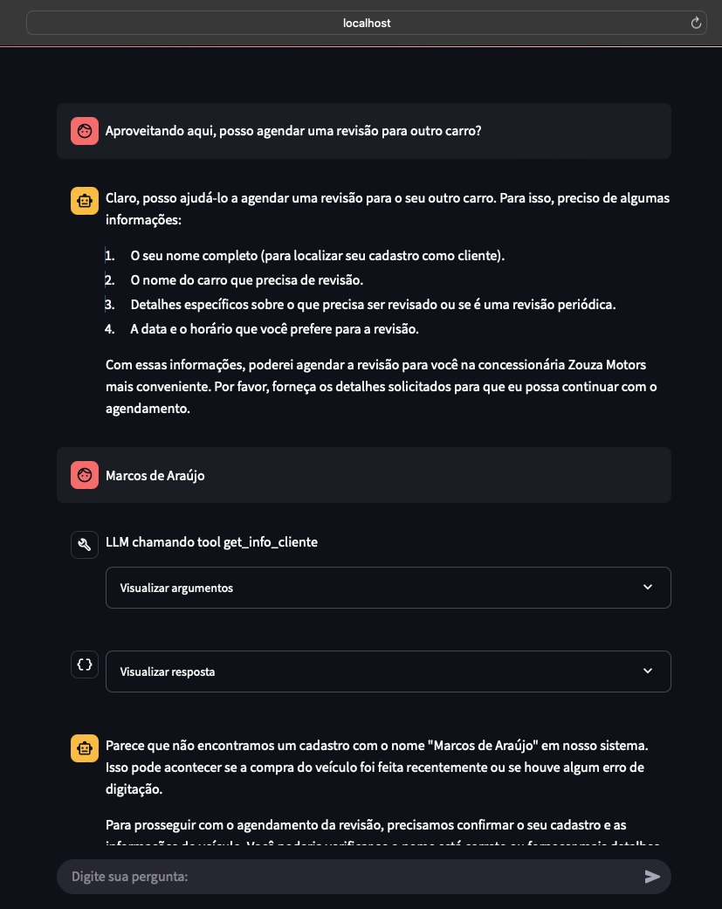

8. Cliente não encontrado na primeira tentativa (tool `get_info_cliente`).  
   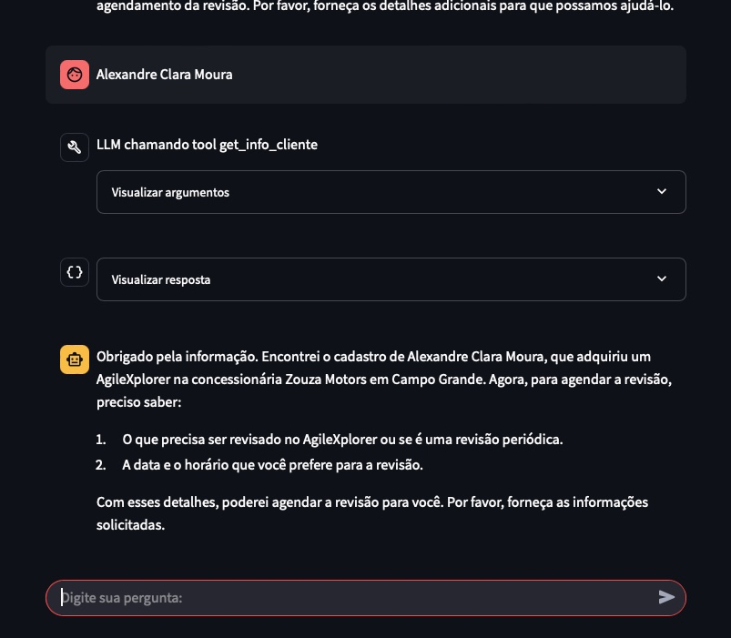

9. Cliente localizado e confirmação de dados.  
   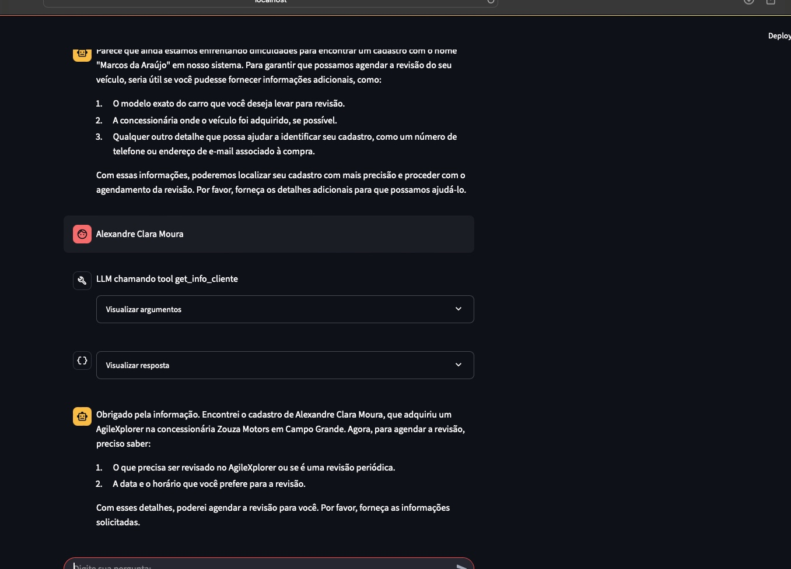

10. Agendamento de revisão via tool `agenda_visita_para_assistencia`.  
    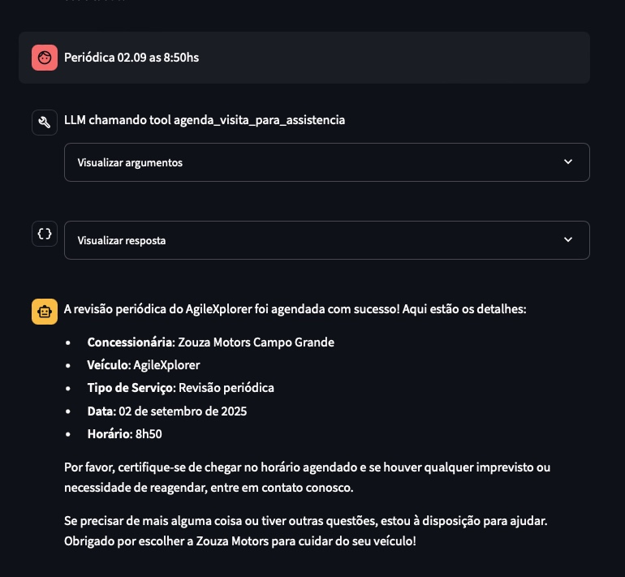

11. Solicitação de agendamento de test drive após revisão.  *(Observe, que no canto superior direito, aparece o agente caso precise mudar naquele momento...)*
    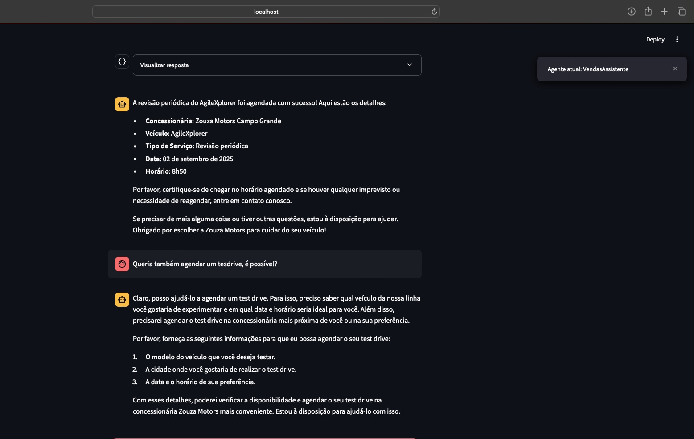

12. Escolha de veículo, local e data para test drive.  
    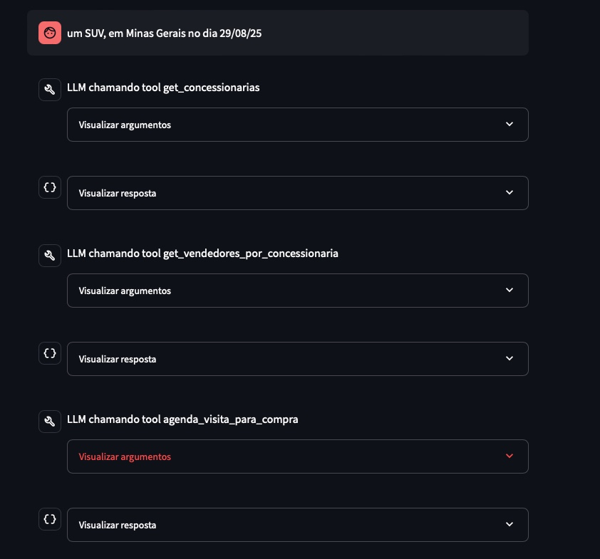

13. Confirmação do agendamento de test drive.  
    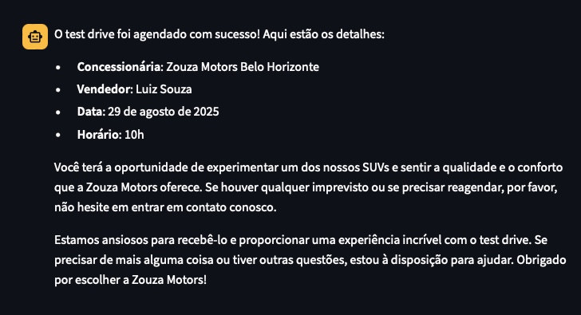

14. Retorno ao agente inicial após finalização do processo. *(Observe, que no canto superior direito, aparece o agente caso precise mudar naquele momento...)*
    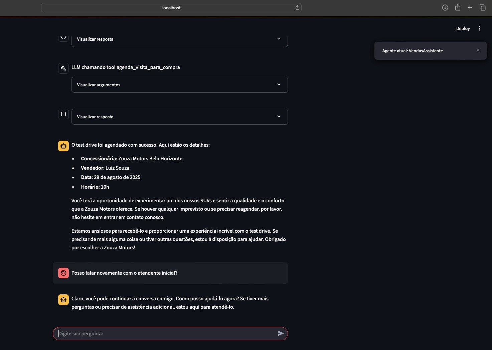

---

## Conclusão  
O projeto demonstra como **IA Generativa + MCP** podem ser aplicados em cenários reais para:  
- Melhorar a experiência do cliente.  
- Automatizar processos de vendas e manutenção.  
- Criar uma arquitetura escalável de agentes especializados.  
- Garantir acesso a dados **em tempo real**, integrando diretamente um banco PostgreSQL online.  

Essa solução pode ser adaptada para qualquer setor que precise de múltiplos agentes colaborando em tempo real (ex.: turismo, saúde, educação, bancos).  

---

## Próximos Passos  
- Expandir o número de agentes (ex.: **Financeiro** para simular financiamento de veículos).  
- Adicionar análises de sentimentos e personalização da experiência.  
- Integrar com sistemas externos de CRM para completar a jornada do cliente.  
